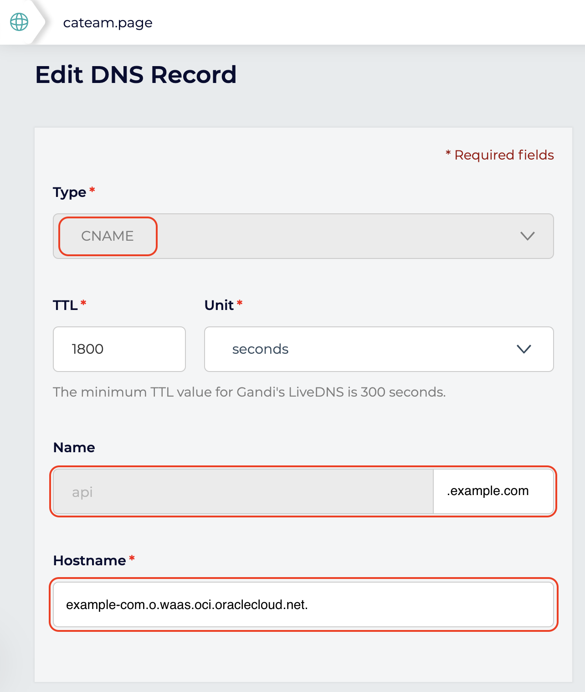

# Oracle WAF Demo

Oracle Web Application Firewall is a cloud native offering to protect your HTTP traffic incoming to your infrastructure.

Five reasons to have Oracle WAF protecting your system.

1. They scale with your business.
2. They block attacks outside your perimeter.
3. They provide the best security for multicloud deployments.
4. Managed services ease your burden.
5. They have low total cost of ownership.

Oracle Cloud Infrastructure WAF employs an intelligent DNS data-driven algorithm that determines the best global point of presence (POP) to serve a given user in real time. As a result, users are routed around global network issues and potential latency while offering the best possible uptime and service levels.

## Introduction

- **HTTP protection** against malicious and unwanted Internet traffic: Cross-Site Scripting (**XSS**), **SQL Injection** and others **OWASP**-defined vulnerabilities.
- Dynamic Denial-of-Service (**DDoS**) protection.
- Payment Card Industry (**PCI**) **compliance**.
- 24x7 **Security Operations Center** (SOC) monitoring traffic.

## Requirements

- Public **certificate chain** for you Fully quialified Domain Name (FQDN)
- Corresponded **private key**
- IP of **endpoint**, load balancer or any publicly facing IP
- Permissions to modify **DNS records** for your domain
- Configure endpoint to accept only ingress traffic from **WAF range of IPs**

## Components

- **Protection Rules**: set of rules that match web traffic and determine the action to be taken
- **Access Control**: based on geolocation, data, whitelisting and blacklisting, HTTP URL and headers
- **Thread Intelligence**: takes feeds from a number of thread intelligence providers to ensure it has the latest, up-to-date information on suspicious IP addresses.
- **Bot Management**: set of challenges including JavaScript verification, CAPTCHA, device fingerprinting, etc to block malicious bot traffic.

## How-to

- Create a WAF **Policy**
- Enable WAF to **Passively Detect Rules**
- Inspect logs to make sure there is **no false positives**
- Enable **blocking capabilities** to WAF to be fully protected


## Lab 100: Create WAF Policy

From the Wec Console


Create WAF Policy


Fill out the details


- Policy Names: A descriptive name for your policy
- Primary Domain: your primary domain
- Additions Domains: any additional domain, for example api\.example\.com
- Origin Name: descriptive (and unique name)
- URI: IPv4 address or fully qualified domain name

## Lab 200: Add TLS termination to your WAF

In order to get the certificate signed by [Let's Encrypt](https://letsencrypt.org/) I used [certbot](https://certbot.eff.org/):

Install certbot manually, but I recommend to use the installation from your distribution repository:

> You might need `sudo` on some operations.

```shell
wget https://dl.eff.org/certbot-auto

mv certbot-auto /usr/local/bin/certbot-auto

/usr/local/bin/certbot-auto --nginx
```

## Lab 300: Redirect traffic to WAF

On your DNS server create a CNAME entry to create an alias from your domain to the WAF target DNS.

On the screnshot I am using an external DNS service to show you it is possible but the performace would be better with Oracle DNS Service:


## Lab 400: Protect your endpoint

**TODO** Test and check logs.

`curl -I https://api.example.com`

**TODO** Enable protection.

## Price

For a up-to-date version, please go to [Offical WAF pricing](https://www.oracle.com/cloud/security/pricing.html)

| Concept                                                    | Price  | Unit          |
| :--------------------------------------------------------- | ------ | ------------- |
| Oracle Cloud Infrastructure Identity and Access Management | Free   |               |
| Oracle Cloud Infrastructure Audit                          | Free   |               |
| Good Traffic                                               | \$0.15 | per Gb        |
| Requests                                                   | \$0.60 | per 1 million |
| Bot Management                                             | \$4.00 | per 1 million |
| DDoS protection                                            | free   |               |

## OCI vs your responsibilities with WAF

| Responsibility                                                             | Oracle | You |
| -------------------------------------------------------------------------- | ------ | --- |
| Onboard/configure the WAF policy for the web application                   | No     | Yes |
| Configure WAF onboarding dependencies (DNS, ingress rules, network)        | No     | Yes |
| Provide high availability (HA) for the WAF                                 | Yes    | No  |
| Monitor for distributed denial of services (DDoS) attacks                  | Yes    | No  |
| Keep WAF infrastructure patched and up-to-date                             | Yes    | No  |
| Monitor data-plane logs for abnormal, undesired behaviour                  | Yes    | Yes |
| Construct new rules based on new vulnerabilities and mitigations           | Yes    | No  |
| Review and accept new recommended rules                                    | No     | Yes |
| Tune the WAF's access rules and bot management strategies for your traffic | No     | Yes |
