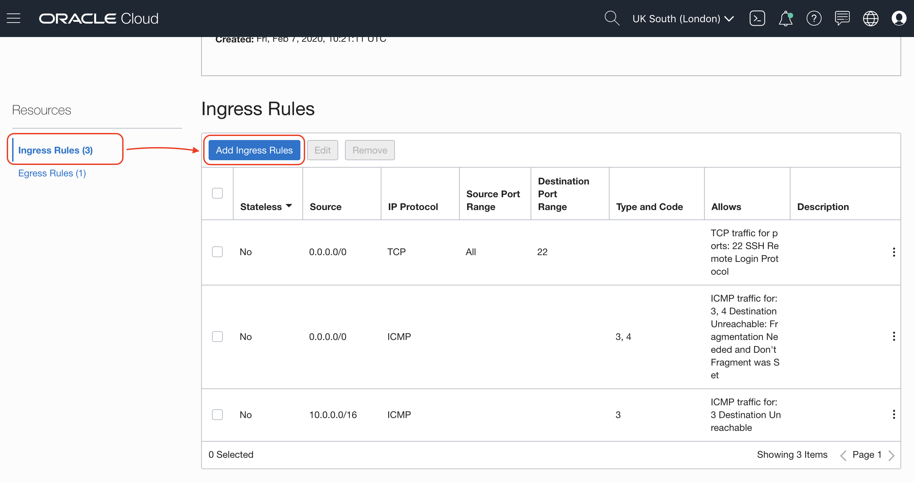
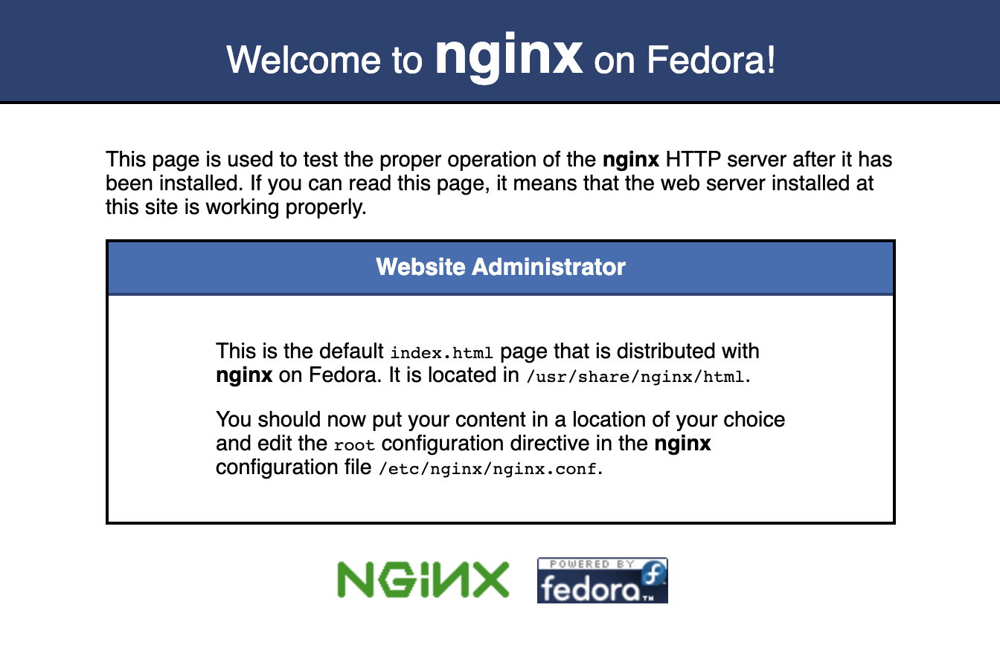
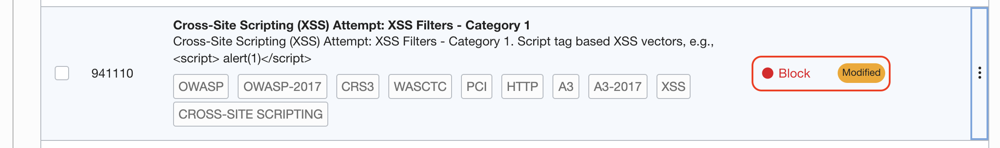

# Oracle WAF Demo

Oracle Web Application Firewall is a cloud native offering to **protect your HTTP traffic** incoming to your infrastructure.

Five reasons to have Oracle WAF protecting your system.

1. They **scale** with your business.
2. They block attacks **outside your perimeter**.
3. They provide the best security for **multicloud** deployments.
4. **Managed services** ease your burden.
5. They have **low total cost of ownership**.

Oracle Cloud Infrastructure WAF employs an intelligent DNS data-driven algorithm that determines the best **global point of presence (POP)** to serve a given user in real time. As a result, users are routed around global network issues and potential latency while offering the best possible uptime and service levels.

## Introduction

- **HTTP protection** against malicious and unwanted Internet traffic: Cross-Site Scripting (**XSS**), **SQL Injection** and others **OWASP**-defined vulnerabilities.
- Dynamic Denial-of-Service (**DDoS**) protection.
- Payment Card Industry (**PCI**) **compliance**.
- 24x7 **Security Operations Center** (SOC) monitoring traffic.

## Requirements

- Public **certificate chain** for you Fully quialified Domain Name (FQDN)
- Corresponded **private key**
- IP of **endpoint**, load balancer or any publicly facing IP
- Permissions to modify **DNS records** for your domain
- Configure endpoint to accept only ingress traffic from **WAF range of IPs**

## Components

- **Protection Rules**: set of rules that match web traffic and determine the action to be taken
- **Access Control**: based on geolocation, data, whitelisting and blacklisting, HTTP URL and headers
- **Thread Intelligence**: takes feeds from a number of thread intelligence providers to ensure it has the latest, up-to-date information on suspicious IP addresses.
- **Bot Management**: set of challenges including JavaScript verification, CAPTCHA, device fingerprinting, etc to block malicious bot traffic.

## How-to

- Create a WAF **Policy**
- Enable WAF to **Passively Detect Rules**
- Inspect logs to make sure there is **no false positives**
- Enable **blocking capabilities** to WAF to be fully protected


---

## Step 1: Mock up a service

If you don't have a HTTP service already, we can create a linux instance and start a web server.

> You need a Virtual Cloud Network with a Public Subnet
>
> You also need a public SSH key

Go to **Menu** > **Compute** > **Instances** and click button **Create Instance**.

- **Name your instance:** service
- **Choose an operating system or image source:** Oracle Linux 7.7
- **Availability Domain:** pick any
- **Instance Shape:** VM.Standard.E2.1 (recommended)
- **Configure networking:** pick your existing Virtual Cloud Network and public subnet
- **Assign a public IP address** mark this radio button
- **Add SSH keys:** pick your public SSH key or paste it

And click the button **Create**.

After few minutes you will have your compute instance with a Public IP address we will use to SSH into. In your terminal:

`ssh opc@<PUBLIC_IP>`

Let's install NGINX as our Web Server. First update repos and then install it:

`sudo yum update -y`

`sudo yum install nginx -y`

Time to start the server and check it is running

`sudo systemctl start nginx`

The service should ve **active**
`systemctl status nginx`

And we can get the index.html page
`wget -O - localhost`

We need to open the web server to the world, first allow port 80 on IPTABLES:

`sudo firewall-cmd --zone=public --add-port=80/tcp --permanent`

Do the same for 443:

`sudo firewall-cmd --zone=public --add-port=443/tcp --permanent`

`sudo firewall-cmd --reload`

That is not all, Oracle Cloud network implements its own security and by default only port 22 on TCP is open to allow SSH. It is also important to **add port 80/tcp on Security List**.

**Menu** > **Networking** > **Virtual Cloud Networks** > and select the one used for the compute instance.

On the small menu on the bottom left corner you will find **Security Lists**, click on the **Default Security List for your VCN**.





Do the same for 443


Check that web server is reachable with the public IP. Open your browser and go to your public ip address. You should see something like this:



---

## Step 2: Create WAF Policy

From the Wec Console


Create WAF Policy


Fill out the details


- **Policy Names**: A descriptive name for your policy
- **Primary Domain**: your primary domain
- **Additions Domains**: any additional domain, for example api\.example\.com
- **Origin Name**: descriptive (and unique name)
- **URI**: IPv4 address or fully qualified domain name

Wait for the WAF Policy to be active, it might take few minutes. Be patient.


Explore the menu on the bottom left part of the WAF policy page to see Metrics


Origin Management


---

## Step 3: Add TLS termination to your WAF

In order to get the certificate signed by [Let's Encrypt](https://letsencrypt.org/) I used [certbot](https://certbot.eff.org/):

Install certbot manually on your compute instance where we previously installed NGINX, but I recommend to use the installation from your distribution repository:

> You might need `sudo` on some operations.

```shell
wget https://dl.eff.org/certbot-auto

mv certbot-auto /usr/local/bin/certbot-auto

/usr/local/bin/certbot-auto --nginx
```

After certbot negotiate the certificates with Let's Encrypt using ACME protocol, the certificates will be created on:

`/etc/letsencrypt/live/api.example.com/*.pem`

Those are the files you need to set up your WAF. You will need `fullchain.pem` and `key.pem` file to configure HTTPS.

Add full chain of certificatates and private key to WAF. Go to **Settings** > **Edit**.

---

## Step 4: Redirect traffic to WAF

On your DNS server create a CNAME entry to create an alias from your domain to the WAF target DNS. You can find the **CNAME target** on the detail page of your WAF policy


On the screnshot I am using an external DNS service to show you it is possible but I recommend to use Oracle DNS Service:


---

## Step 5: Protect your endpoint

At this point you should be able to hit your service on the public IP address, and the CNAME target to hit your service through your WAF.

It is time to protect your service applying rules.

See how easy you can add **Protection Rules** to detect or block request:


Search for `981300` rule


Block this type of requests


Search for `941100` rule


Block this type of requests as well




On the WAF Policy detail page, click **Publish All (2)** button


Confirm with **Publish All** button


After few minutes the new rules will be provisioned on the distributed multi PoP WAF.

You have also WAF recommend protection rules as well


An configure how the rules are being applied:


### Access Control

Access Control:

Access Control allow you to filter out request from specific locations, IP black and whitelisting, etc


Try this example, depending on your current location, add the details of your access rule and send a request. In my case I'm _detecting_ but not blocking requests from a specific country.


All the changes goes into a staging state ready to publish when you are happy with all the settings you have change:


Ready? From **Unpublished Changes** click the button **Publish All** or select the ones you want to apply now:


Read the message, this changes will be applied securily and accross all the Point of Present around the globe and it might take few minutes, then confirm with **Publish All** button:


The WAF Policy will go into updating state until the changes are applied:


Time to check everything worked as expected

`curl -I https://api.example.com`

You will see there are new headers on the request:

`server: ZENEDGE` and `x-cdn: Served-By-Zenedge`


---

## Price

For a up-to-date version, please go to [Offical WAF pricing](https://www.oracle.com/cloud/security/pricing.html)

| Concept                                                    | Price    | Unit          |
| :--------------------------------------------------------- | -------- | ------------- |
| Oracle Cloud Infrastructure Identity and Access Management | **Free** |               |
| Oracle Cloud Infrastructure Audit                          | **Free** |               |
| Good Traffic                                               | \$0.15   | per Gb        |
| Requests                                                   | \$0.60   | per 1 million |
| Bot Management                                             | \$4.00   | per 1 million |
| DDoS protection                                            | **free** |               |

## OCI vs your responsibilities with WAF

| Responsibility                                                             | Oracle | You     |
| -------------------------------------------------------------------------- | ------ | ------- |
| Onboard/configure the WAF policy for the web application                   | No     | **Yes** |
| Configure WAF onboarding dependencies (DNS, ingress rules, network)        | No     | **Yes** |
| Provide high availability (HA) for the WAF                                 | Yes    | No      |
| Monitor for distributed denial of services (DDoS) attacks                  | Yes    | No      |
| Keep WAF infrastructure patched and up-to-date                             | Yes    | No      |
| Monitor data-plane logs for abnormal, undesired behaviour                  | Yes    | **Yes** |
| Construct new rules based on new vulnerabilities and mitigations           | Yes    | No      |
| Review and accept new recommended rules                                    | No     | **Yes** |
| Tune the WAF's access rules and bot management strategies for your traffic | No     | **Yes** |
